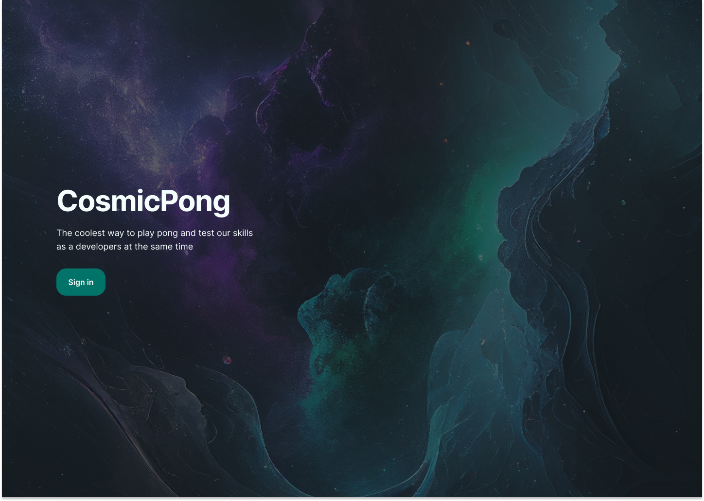
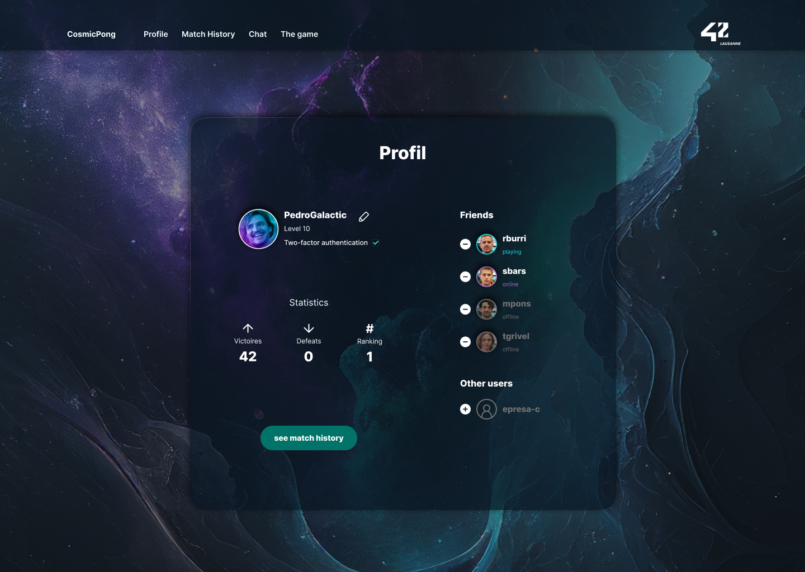
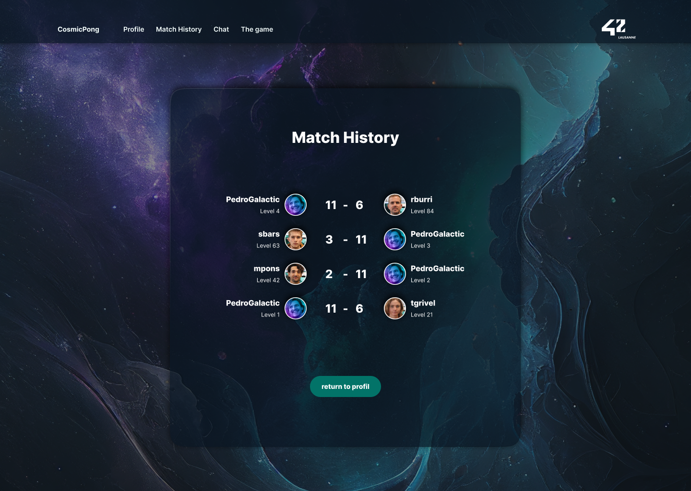
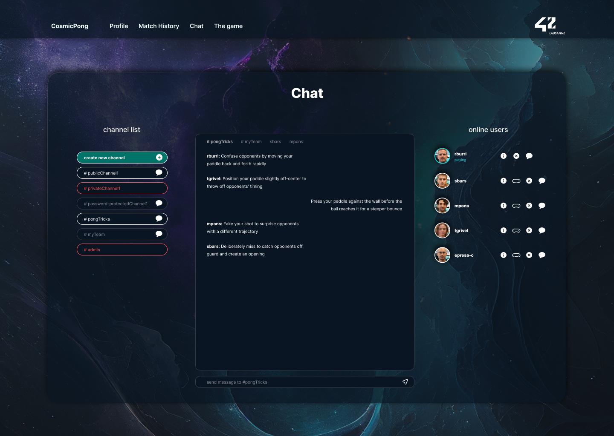
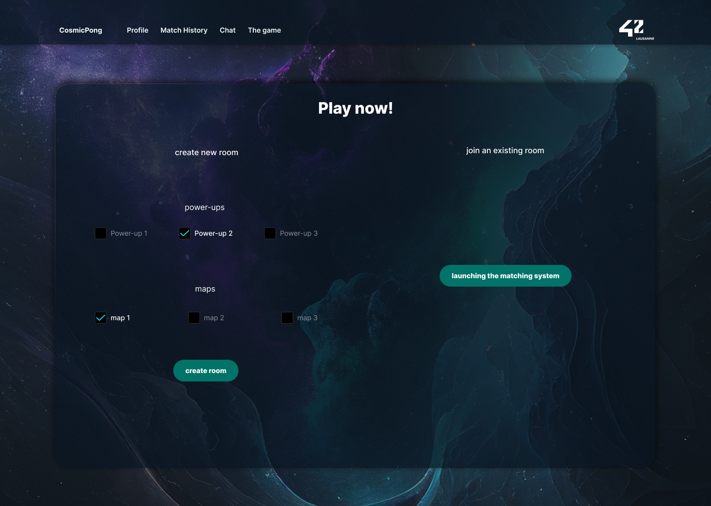
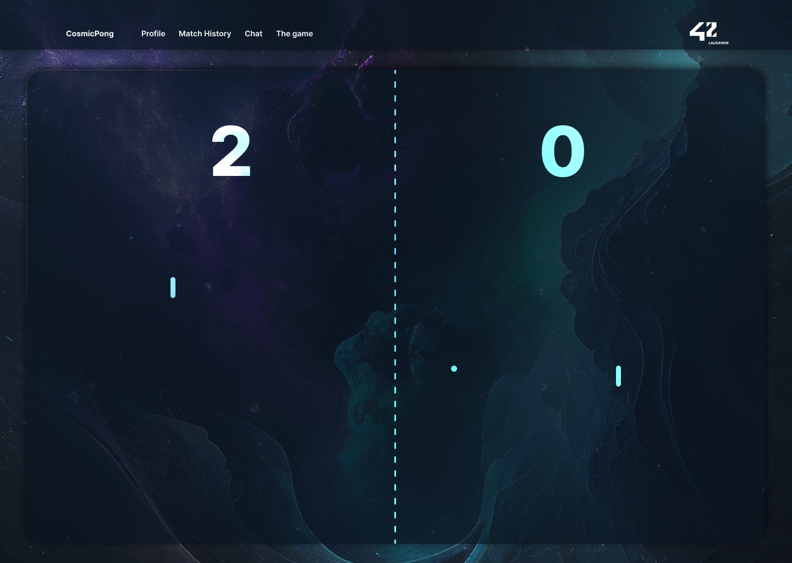
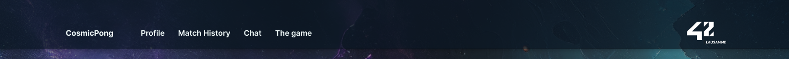
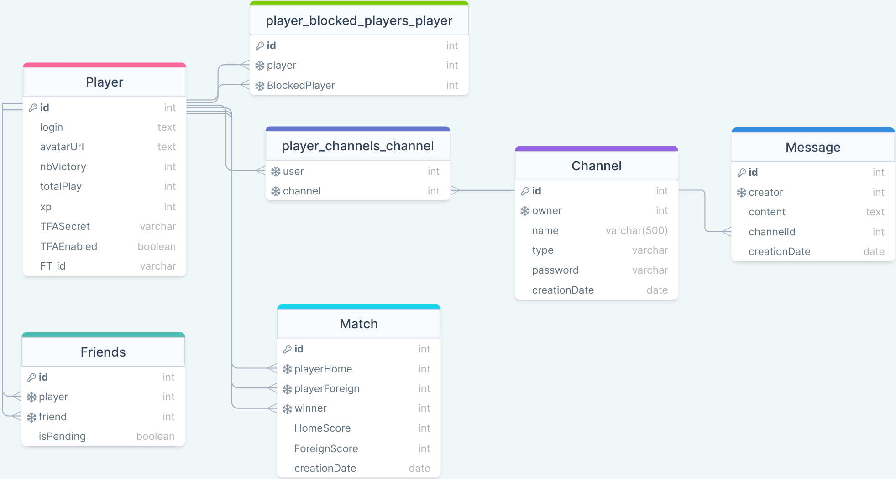

= Transcendence
:nofooter:
:toc: left

== 42 authentification

[plantuml, target=assets/authentification, format=svg, width=100%]
....
participant client
participant backend
participant "https://api.intra.42.fr/" as 42api

client -> backend : GET /api/auth/42
note left : Sign In\nButton Clicked

group passport

  hnote over backend : passport: init through guards()
  backend -> 42api : /oauth/authorize
  42api -> client : send a validation page
  client -> 42api : validate
  42api -> backend : POST /api/auth/42/redirect\n
  note right : authorization code
  backend --> 42api : POST /oauth/token
  note left : ""API: UUID""\n""API: secret""\n""URL: code""
  42api --> backend : token of 42 user
  hnote over backend : passport: validate()
  hnote over backend : passport: login redirect()

end

backend -> client : redirection
....

== Docker environment for development

image::assets/docker_env_dev.png[]

[plantuml, target=assets/docker, format=svg, width=100%]
....
rectangle localhost {
	database "our-data" as our_data
	circle "port 8080" as portout_nest
	circle "port 6060" as portout_postgre
	circle "port 4040" as portout_react

	rectangle docker {
		cloud app-net {
			rectangle NestJS [
				container name: <b>our-backend
				port: <b>3000
				framework: <b>NestJS
			]
			rectangle PostgreSQL [
				container name: <b>our-postgresql
				port: <b>5432
				framework: <b>PostgreSQL
			]
		}
		rectangle React [
			container name: <b>our-frontend
			port: <b>5173
			framework: <b>React
		]
	}
}

NestJS -up-> portout_nest
React -up-> portout_react
PostgreSQL -up-> portout_postgre
NestJS <-le-> PostgreSQL
PostgreSQL <==> our_data
....

== Project overview

=== Page 1: Welcome

==== Functionalities:

* Login with the intranet OAuth system 42

==== Technical requirements:

* Communication with OAuth 42

==== Graphical requirements:

* Background, login button

=== Page 2: Compte utilisateur

==== 2.1 Profile

==== Functionalities:

* You can choose a (unique) username to be displayed on the site. We start with the default name taken from OAuth 42 (?)
* You can upload an avatar. If you don't, it is by default to your 42 profile picture (?)
* You can enable two-factor authentication, 2FA (Google Authenticator or send sms to mobile phone)
* Add other users as friends and view real time status (online, offline, playing, etc.)

==== Technical needs:

* Get via OAuth 42 the photo and name and assign them as default values to AVATAR and USERNAME
* Username, verify that it does not exist as it has to be unique
* Be able to upload a photo as avatar
* Integration of 2FA
* Get user statistics

==== Graphical requirements:

* Profile window with data:
** Username (editable)
** Avatar (editable)
** 2FA (on / off)
* Statistics
** Victories and defeats
** Rank
** Level
** Achievements
** Etc.
* Button to add friends and see their status

==== 2.2 Match History

==== Functionalities:

* Display of history including 1 vs 1, levels and so on. Anyone who is logged in should be able to consult it

==== Technical requirements:

* Get history

==== Graphical requirements:

* Table with history

=== Page 3: Chat

==== Functionalities :

* Create channels
** public
** private
** password protected
* Join a channel (not requested by the subject but it is logical to add it)
* Send direct messages to other users
* Block other users
* Invite other users to play pong
* Access to other players' profiles

==== Technical requirements:

_To be completed..._

==== Graphic requirements:

_Design made directly from the description of the subject to optimise time_

=== Page 4: The game

==== Functionalities:

* Launch the game of pong against another player
* Matching system (waiting list)
* Canvas with the game
* Customisation options (we have to define which ones)
* The game must be responsive

==== Technical needs:

_To be completed..._

==== Graphic needs:

_Design made directly from the description of the subject to optimize time_

=== Navigation bar

. Logo (Just the 'CosmicPong' word)
. Profil
. Match History
. Chat
. The game
. LogOut (?)
. Logo 42Lausanne

=== Window scheme

[plantuml, target=assets/design, format=svg, width=100%]
....
rectangle {

	object "Page 1" as Page1
	object "Page 2" as Page2
	object "Page 3" as Page3
	object "Page 4" as Page4

	object Welcome {
		Login with the intranet OAuth system 42
		Communication with OAuth 42
	}

	object Profile {
		Choose username
		Choose/upload an avatar
		Enable 2FA
		Add users as friends
		See the status of friends in real time
	}

	object "Match history" as MatchHistory{
		Display of history including 1 vs 1
	}

	object Chat{
		Create channels
		Join channels
		Send direct messages to other users
		Block other users
		Invite other users to play pong
		Access to other players' profiles
	}

	object "Navigation bar" as Navbar{
		CosmicPong (logo)
		Profil
		Match History
		Chat
		The game
		LogOut (?)
		42Lausanne (logo)
	}

	object "The game" as TheGame {
		Launch the game of pong against another player
		Customisation options (power-ups and maps)
		Matching system (waiting list)
	}

	object "Canvas with the game" as CanvasWithTheGame{
		The game must be responsive
	}

	Page1 --> Welcome
	Page2 --> Profile
	Page2 --> Navbar
	Profile --> MatchHistory
	MatchHistory --> Profile
	Page3 --> Chat
	Page3 --> Navbar
	Page4 --> TheGame
	TheGame --> CanvasWithTheGame
	Page4 --> Navbar
}
....

== Database

